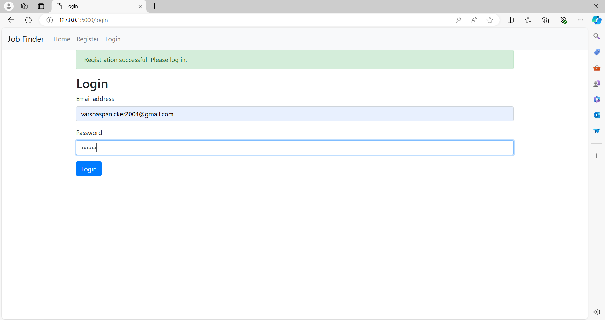
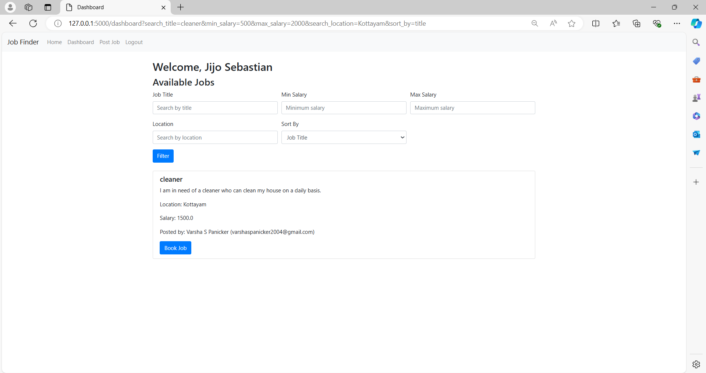
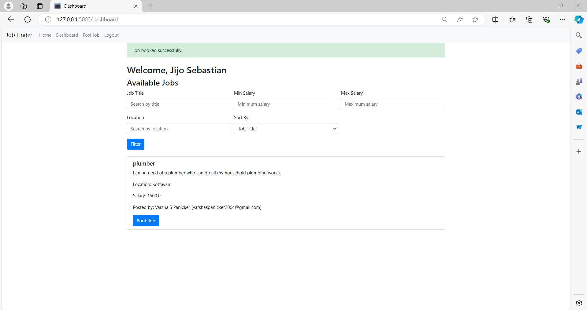
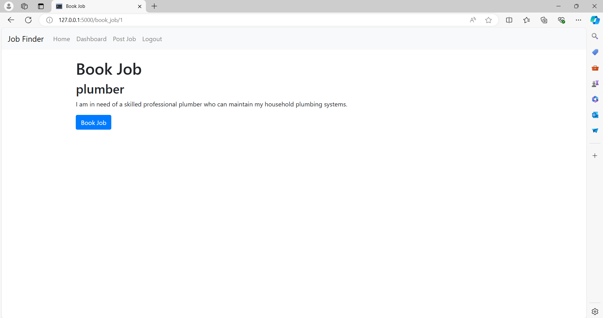

# 💼 Job Finder Platform

A full-stack web application designed to connect service seekers with service providers through job posting, searching, filtering, and booking functionality.

This project was developed as part of the **Intel Unnati Industrial Training Program** and focuses on simplifying access to employment and local service opportunities through an integrated web platform.

---

## 📌 Overview

The Job Finder Platform provides a centralized system where users can register, manage their information, post job opportunities, search for available jobs, and book jobs.

The application combines a **Flask-based backend**, database management using **SQLAlchemy**, and a responsive **Bootstrap-based frontend**.

---

## ✨ Features

### 👤 User Management
- User registration
- Secure login and logout
- Password hashing using Werkzeug
- Session-based authentication
- User information including degree and skills

### 💼 Job Management
- Create and publish job listings
- Store job title, description, location, and salary
- View available jobs
- Associate jobs with the users who posted them

### 🔎 Search & Filtering
Users can search and filter available jobs by:

- Job title
- Minimum salary
- Maximum salary
- Location

Jobs can also be sorted by title, salary, or location.

### 🤝 Job Booking
- Registered users can book available jobs
- Booked jobs are associated with the user who accepted them
- Booked jobs are removed from the available-job query
- Booking information is stored in the database

### 📧 Email Integration
- Flask-Mail integration for email-related functionality

### 📱 Responsive Interface
- Bootstrap-based responsive design
- Reusable Jinja templates
- Flash messages for user feedback

---

## 🛠️ Tech Stack

### Backend
- Python
- Flask
- Flask-SQLAlchemy
- Flask-Mail
- Werkzeug

### Frontend
- HTML5
- CSS
- JavaScript
- Bootstrap
- Jinja2

### Database
- SQLite
- SQLAlchemy ORM

### Core Concepts
- Full-Stack Web Development
- CRUD Operations
- User Authentication
- Password Hashing
- Session Management
- Relational Database Design
- Search & Filtering
- Backend–Frontend Integration

---

## 🏗️ Application Architecture

```text
             ┌─────────────────────┐
             │        User         │
             └──────────┬──────────┘
                        │
                        ▼
             ┌─────────────────────┐
             │ HTML / Bootstrap    │
             │ Jinja Templates     │
             └──────────┬──────────┘
                        │
                        ▼
             ┌─────────────────────┐
             │    Flask Backend    │
             │                     │
             │ • Authentication    │
             │ • Job Management    │
             │ • Search & Filter   │
             │ • Booking Logic     │
             └──────────┬──────────┘
                        │
                        ▼
             ┌─────────────────────┐
             │   SQLAlchemy ORM    │
             └──────────┬──────────┘
                        │
                        ▼
             ┌─────────────────────┐
             │       SQLite        │
             │   Users │ Jobs      │
             └─────────────────────┘
```

---

## 🔄 Application Workflow

```text
Register
   ↓
Login
   ↓
Dashboard
   ↓
Browse Available Jobs
   ↓
Search / Filter / Sort
   ↓
Select Job
   ↓
Book Job
```

Users can also post new opportunities:

```text
Login → Post Job → Store in Database → Display to Other Users
```

---

## 📸 Application Screenshots

### 🔐 Login Page

Users can securely log in using their registered credentials.



### 💼 Job Dashboard

The dashboard allows users to view available opportunities and interact with job listings.



### 🔎 Job Search & Filtering

Users can filter available opportunities based on criteria such as job title, salary, and location.



### 🤝 Job Booking

Users can select and book an available job directly through the platform.



---

## 🗄️ Database Design

The application primarily uses two SQLAlchemy models:

### User

Stores:

- User ID
- Username
- Email
- Password
- Degree
- Skills
- Posted jobs
- Booked jobs

### Job

Stores:

- Job ID
- Title
- Description
- Location
- Salary
- Poster ID
- Booker ID

The relationships between these models allow the application to identify who posted a job and who booked it.

---

## 🔐 Authentication & Security

The application uses Werkzeug password hashing rather than storing passwords directly in plain text.

The project uses:

```python
generate_password_hash()
check_password_hash()
```

Flask sessions are used to maintain authenticated user sessions and restrict access to protected functionality such as the dashboard, job posting, and job booking.

---

## 📂 Main Application Pages

The application includes templates for:

```text
base.html
index.html
login.html
register.html
dashboard.html
post_job.html
book_job.html
```

These templates interact with Flask routes to provide authentication, job management, searching, filtering, and booking functionality.

---

## 🚀 Running the Project Locally

### 1. Clone the repository

```bash
git clone https://github.com/Varsha-200/job-finder-platform.git
cd job-finder-platform
```

### 2. Create a virtual environment

```bash
python -m venv venv
```

### 3. Activate the environment

**Windows**

```bash
venv\Scripts\activate
```

**macOS/Linux**

```bash
source venv/bin/activate
```

### 4. Install dependencies

```bash
pip install Flask Flask-SQLAlchemy Flask-Mail Werkzeug
```

### 5. Run the application

```bash
python app.py
```

Open the local address displayed by Flask in your browser.

---

## 📖 Project Report

For additional details about the project design, implementation, and development process, see:

**[Intel Unnati Project Report](Intel-Unnati-Project-Report.pdf)**

---

## 🎓 Intel Unnati Program

This project was developed as part of the **Intel Unnati Industrial Training Program**.

The project explored how a web-based platform could make employment and common service opportunities more accessible by directly connecting service seekers and service providers.

---

## 👥 Team

- **Varsha S Panicker**
- Sreya Elizabeth Shibu
- Jijo Sebastian
- Geethanjali P.

**Project Mentor:** Dr. Anju Pratap  
**Institution:** Saintgits College of Engineering and Technology

---

## 💡 Key Learnings

Through this project, I gained practical experience in:

- Building full-stack applications with Flask
- Designing database models using SQLAlchemy
- Connecting frontend interfaces with backend logic
- Implementing registration and authentication
- Secure password handling
- Session management
- Job search and filtering functionality
- Working with relational data
- Creating responsive interfaces with Bootstrap
- Collaborating on a team-based software project

---

## 🔮 Future Improvements

Potential future enhancements include:

- Dedicated service-provider and service-seeker roles
- Advanced skill-based job matching
- Enhanced email notifications
- User profile management
- Job application and booking history
- Employer and worker ratings
- REST API endpoints
- Improved UI/UX
- Stronger form validation
- Automated testing
- Cloud deployment
- Recommendation-based job matching

---

## 📄 Disclaimer

This project was developed for educational and training purposes as part of the Intel Unnati program.
